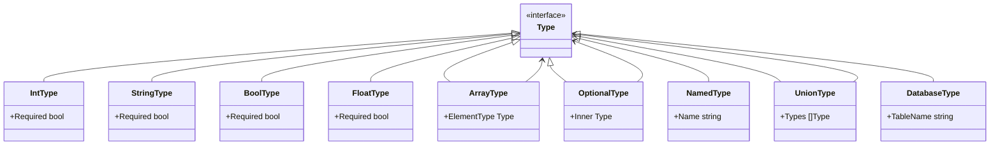

# GlyphLang Architecture Design

This document provides comprehensive architecture diagrams for the GlyphLang compiler and runtime system.

## Table of Contents
1. [High-Level Architecture](#high-level-architecture)
2. [Compilation Pipeline](#compilation-pipeline)
3. [Package Dependencies](#package-dependencies)
4. [Request Execution Flow](#request-execution-flow)
5. [AST Structure](#ast-structure)
6. [Virtual Machine Architecture](#virtual-machine-architecture)
7. [Server Architecture](#server-architecture)
8. [Database Integration](#database-integration)
9. [WebSocket Architecture](#websocket-architecture)
10. [JIT Compilation](#jit-compilation)

---

## High-Level Architecture


---

## Compilation Pipeline


### Compilation Stages Detail


---

## Package Dependencies


---

## Request Execution Flow


### Route Matching Detail


---

## AST Structure


### Type System



---

## Virtual Machine Architecture


### Opcode Categories


---

## Server Architecture


---

## Database Integration


### Database Layer Structure


---

## WebSocket Architecture


### WebSocket Message Flow


---

## JIT Compilation


### JIT Tiers


---

## Binary Format


### Binary Structure Detail


---

## Observability Stack


---

## Security Architecture

```mermaid
flowchart TD
    subgraph "Input Layer"
        REQ["HTTP Request"]
        BODY["Request Body"]
        PARAMS["URL Parameters"]
    end

    subgraph "Security Checks"
        SQL["SQL Injection\nDetector"]
        XSS["XSS\nDetector"]
        VAL["Input\nValidator"]
    end

    subgraph "Authentication"
        JWT["JWT\nValidator"]
        API["API Key\nChecker"]
        RATE["Rate\nLimiter"]
    end

    subgraph "Safe Execution"
        SAFE["Sanitized\nContext"]
        EXEC["Route\nExecution"]
    end

    REQ --> JWT
    REQ --> API
    JWT --> RATE
    API --> RATE

    BODY --> SQL
    BODY --> XSS
    PARAMS --> VAL

    SQL -->|"Safe"| SAFE
    XSS -->|"Safe"| SAFE
    VAL -->|"Valid"| SAFE
    RATE -->|"Allowed"| SAFE

    SQL -->|"Threat"| BLOCK["Block & Log"]
    XSS -->|"Threat"| BLOCK

    SAFE --> EXEC
```

---

## Development Workflow

```mermaid
flowchart LR
    subgraph "Development"
        CODE["Write .glyph"]
        SAVE["Save File"]
    end

    subgraph "Hot Reload"
        WATCH["File Watcher"]
        PARSE["Re-parse"]
        RELOAD["Hot Reload"]
    end

    subgraph "LSP"
        DIAG["Diagnostics"]
        COMP["Completions"]
        HOVER["Hover Info"]
    end

    subgraph "Testing"
        RUN["glyph run"]
        TEST["Integration Tests"]
    end

    subgraph "Production"
        BUILD["glyph compile -O3"]
        DEPLOY["Deploy .glyphc"]
    end

    CODE --> SAVE
    SAVE --> WATCH
    WATCH --> PARSE
    PARSE --> RELOAD
    PARSE --> DIAG
    PARSE --> COMP
    PARSE --> HOVER

    CODE --> RUN
    RUN --> TEST
    TEST --> BUILD
    BUILD --> DEPLOY
```

---

## Summary

GlyphLang is a complete backend language system with:

| Component | Purpose |
|-----------|---------|
| **Parser** | Tokenization and AST generation |
| **Type Checker** | Static type validation |
| **Compiler** | Bytecode generation with optimization |
| **VM** | Stack-based bytecode execution |
| **Interpreter** | Tree-walking execution |
| **Server** | HTTP/WebSocket request handling |
| **JIT** | Runtime optimization |
| **Security** | SQL injection and XSS protection |
| **Observability** | Metrics, tracing, and logging |

Performance characteristics:
- **Compilation**: ~867ns (sub-microsecond)
- **Execution**: 2.95-37.6ns per operation
- **Bytecode compression**: 94-99%
- **Test coverage**: 1696+ tests passing
